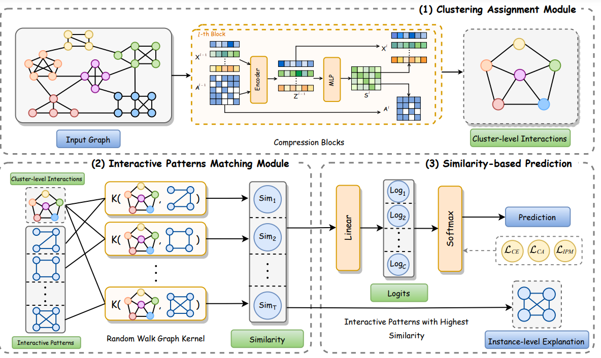

<h3 align="center">🌟Unveiling Global Interactive Patterns across Graphs: Towards Interpretable Graph Neural Networks🌟</h3>

<div align="center">
  
| **[Environment Setup](#environment-setup)**
| **[Quick Start](#quick-start)** 
| **[Paper](http://arxiv.org/abs/2407.01979)**
| **[Video](https://youtu.be/V2Hstu-e2ow?list=PLn0nrSd4xjja0X85oQRfVQarMKL-pocwR)**
| **[Datasets](#datasets)**


</div>

## Environment Setup
Before you begin, please make sure that you have Anaconda or Miniconda installed on your system.

```
# Create and activate a new Conda environment named 'GIP'
conda create -n GIP
conda activate GIP
```

Download the dependencies from the *requirements.txt*:
```
# Install dependencies from files
pip install -r requirements.txt
```

## Quick Start
The Architecture of GIP is shown as follows:


We have provided scripts with hyper-parameter settings to get the experimental results, and you can obtain the experimental results by running the parameters you want:
```
python -m train --bmname=<dataset> --assign-ratio=<compression_ratio> --hidden-dim=<hiddden_dim> --output-dim=<output_dim> --num-classes=<num_of_classes> --method=soft-assign --epochs=<epochs> --max-nodes=<max_node> --ker-hidden-graphs=<num_of_prototypes> --ker-size-hidden-graphs=<num_of_nodes_in_prototype> --ker-max-step=<max_walk_steps>
```

The experimental parameter settings for the results in the paper are shown below：
```
For example:
# ENZYMES
python -m train --bmname=ENZYMES --assign-ratio=0.05 --hidden-dim=24 --output-dim=8 --cuda=0 --num-classes=6 --method=soft-assign --epochs=500 --max-nodes=200 --ker-hidden-graphs=24 --ker-size-hidden-graphs=10

# DD
python -m train --bmname=DD --assign-ratio=0.1 --hidden-dim=64 --output-dim=64 --num-classes=2 --method=soft-assign --epochs=300 --max-node=300 --ker-hidden-graphs=6 --ker-size-hidden-graphs=8 --ker-max-step=3 --feature=label

# PROTEINS
python -m train --bmname=PROTEINS --assign-ratio=0.1 --hidden-dim=16 --output-dim=16 --num-classes=2 --method=soft-assign --epochs=500 --max-nodes=300 --ker-hidden-graphs=8 --ker-size-hidden-graphs=10 --ker-max-step=3

# COLLAB
python -m train --bmname=COLLAB --assign-ratio=0.1 --hidden-dim=16 --output-dim=3 --num-classes=3 --method=soft-assign --epochs=500 --max-nodes=300 --ker-hidden-graphs=15 --ker-size-hidden-graphs=10 --ker-max-step=3

# GraphCycle
python -m train --bmname=GraphCycle --assign-ratio=0.05 --hidden-dim=5 --output-dim=5 --num-classes=2 --method=soft-assign --ker-hidden-graphs=8 --ker-size-hidden-graphs=8 --ker-max-step=3 --feature=deg-num

# GraphFive
python -m train --bmname=FiveClass --assign-ratio=0.05 --hidden-dim=8 --output-dim=5 --num-classes=5 --method=soft-assign --epochs=500 --max-nodes=300 --ker-hidden-graphs=20 --ker-size-hidden-graphs=10 --ker-max-step=3
```

## Datasets
Please download the dataset from <https://chrsmrrs.github.io/datasets/docs/home/>

| Dataset    | Graphs | Avg.nodes | Avg.edges | Graph classes | Domain      |
|------------|--------|-----------|-----------|---------------|-------------|
| ENZYMES    | 600    | 32.63     | 62.14     | 6             | proteins    |
| D&D        | 1178   | 284.32    | 715.66    | 2             | proteins    |
| PROTEINS   | 1113   | 39.06     | 72.82     | 2             | proteins    |
| MUTAG      | 188    | 17.93     | 19.79     | 2             | molecular   |
| COLLAB     | 5000   | 74.49     | 2457.78   | 3             | molecular   |
| GraphCycle | 2000   | 297.70    | 697.18    | 2             | synthetic   |
| GraphFive  | 5000   | 375.98    | 1561.77   | 5             | synthetic   |

## Citation
🌹Please cite our work if it is helpful:

```
@article{wang2024unveiling,
  title={Unveiling Global Interactive Patterns across Graphs: Towards Interpretable Graph Neural Networks},
  author={Wang, Yuwen and Liu, Shunyu and Zheng, Tongya and Chen, Kaixuan and Song, Mingli},
  journal={arXiv preprint arXiv:2407.01979},
  year={2024}
}
```
